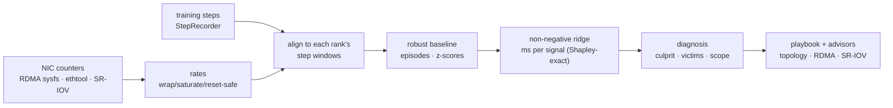

# ai-nic-perf-profiler (`nicprof`)

**An observability primitive that closes the attribution gap between NIC hardware counters and distributed-training
throughput, so teams can make data-driven decisions on fabric topology, RDMA tuning and SR-IOV partition sizing.**

A 512-GPU job slows from 394 ms to 453 ms per step. The network team has millions of counter series; the ML team has
a step-time graph. Nobody can say *which counter explains which millisecond*. `nicprof` does:

```
## Episode 1: steps 120-200 (sustained, 81 steps)
Step time 394.1 ms → 452.8 ms (+14.9%). Excess 4.89 s over the episode; 98% explained by NIC counter evidence.

### Primary: Host RX backpressure (98% of excess, evidence 1.00)
- Decision domain: RDMA / host tuning
- Scope: rank · Suspect: receive path on host-0:mlx5_0 (PCIe link, GPUDirect, receive queue depth)
- Evidence:
  - rank 0 (host-0:mlx5_0, leaf-0): pause_sent_rate=1178 vs baseline 0 (z=58.9)
  - rank 0 (host-0:mlx5_0, leaf-0): drop_rate=1097 vs baseline 0 (z=219.4)
  - rank 15 (host-3:mlx5_3, leaf-1): tx_paused_frac=0.0814 vs baseline 0 (z=20.3) (victim of pause propagation, not a cause)
Recommended actions
1. Check the NIC's PCIe link: `lspci -vv -s <bdf> | grep -E 'LnkCap|LnkSta'` ...
```
<sub>Output of `nicprof demo` (simulated fault). Note the last evidence line: the loudest pause counter belongs to a
**victim**, because PFC propagates hop-by-hop, and the engine traces it back to the origin.</sub>

## How it works



1. **Collect** RDMA port counters and `hw_counters` from sysfs, PFC pause durations and PHY counters from `ethtool -S`,
   and per-VF stats and rate caps from `ip -j link`. Canonicalise across sources and handle 32-bit wrap, saturating
   IB error counters and driver resets explicitly.
2. **Align** by integrating each rank's NIC rates over *that rank's* step windows. They share a host clock, so
   cross-host skew drops out; step number acts as a logical clock across hosts.
3. **Detect** degradation episodes against a median/MAD baseline, ignoring checkpoint spikes.
4. **Decompose** excess step time with non-negative ridge regression on the *worst rank per feature* (collectives
   run at the slowest link's pace). For an additive model, coefficient × delta is the exact Shapley value.
5. **Diagnose** with evidence rules that know PFC semantics (paused ≠ pausing), physical errors explain
   retransmits, and so on. Localise to rank, host, leaf or fabric, and emit concrete remediation with a verification step.
   If the counters don't explain the slowdown, say **"not the network"**.
6. **Decide**: the SR-IOV and fabric advisors estimate what a change would buy, calibrated to measured step time.

Details: [architecture](docs/architecture.md) · [methodology](docs/methodology.md) ·
[counter reference](docs/counter-reference.md) · [design decisions](docs/design-decisions.md)

## Results

Measured with the built-in fault-injection simulator: 16 ranks, 2 leaves, 400G, 1% step jitter, clock skew, counter
resets and checkpoint spikes. These numbers validate the pipeline, **not real hardware accuracy**
([why, and the hardware validation plan](docs/methodology.md#6-evaluation-and-what-it-does-and-doesnt-prove)).
Full tables and reproduction: [`benchmarks/RESULTS.md`](benchmarks/RESULTS.md).

| | Result |
|---|---|
| Top-1 root cause, 8 fault types × 10 seeds | **80/80**, culprit precision/recall 100%, 93-99% of excess explained |
| Healthy runs (spikes, reset, skew) | 0 false-positive episodes |
| Compute straggler (network healthy) | correctly reported as *not the network*; only 17% of excess attributed to counters |
| Rank-0-only step logging (clock-offset path) | 40/40 |
| Detection floor (severity sweep) | 100% at ≥ 6% slowdown, 88% at ~4%, 38% at ~2%. **Detection, not attribution, is the limit** |
| Sampling interval 0.05-1.6 s (step 0.39 s) | no loss on sustained episodes |
| Analysis cost | ~130 µs per (step × rank), linear; 512 ranks × 120 steps in 8.3 s, single process |

Advisor highlights:
- **SR-IOV**: 4 VFs bursting to 150 Gb/s on a 400G PF. When the bursts are synchronised (one DP job), the synchrony
  index is 0.96 and the PF fits 2 VFs. When they're independent (four jobs), the index is 0.48, all 4 VFs fit, and
  hard caps would waste capacity. Sum-of-peaks sizing gets both cases wrong.
- **Fabric**: 64 hosts × 8 NICs at 2:1 oversubscription with scattered placement. The model predicts +35% step
  throughput from topology-aware placement plus `NCCL_IB_QPS_PER_CONNECTION=4` (free), vs +10% from buying 1:1 leaves.

## Quick start

```bash
pip install -e ".[dev]"          # Python ≥ 3.10; deps: click, numpy, PyYAML

nicprof demo                      # simulate a fault, run the pipeline from files, print the report
nicprof scenarios                 # list the 9 fault scenarios
nicprof evaluate --seeds 5        # accuracy table; add --sweep severity for the sensitivity curve
```

On real hosts:

```bash
nicprof discover                                                  # RDMA ports, netdevs, link speeds
nicprof collect --interval 0.25 --source rdma --ethtool-if ens1f0np0 \
    --out counters.jsonl --prom-textfile /var/lib/node_exporter/textfile/nicprof.prom
```

In the training loop ([full example](examples/pytorch_training_hook.py)):

```python
from ai_nic_perf_profiler import StepRecorder
with StepRecorder(f"steps.rank{rank}.jsonl", rank=rank, sync=torch.cuda.synchronize) as rec:
    for batch in loader:
        with rec.step():
            train_step(batch)
```

Then attribute:

```bash
nicprof analyze --counters counters.jsonl --steps steps.rank*.jsonl --topology topology.yaml \
    --json report.json --markdown report.md --prom attribution.prom
nicprof advise sriov  --counters vf_counters.jsonl --select ens1f0/vf --line-gbps 400
nicprof advise fabric --hosts 64 --hosts-per-leaf 4 --uplinks-per-leaf 16 --report report.json --compute-s 0.30
```

See [`configs/default.yaml`](configs/default.yaml) and [`configs/topology.example.yaml`](configs/topology.example.yaml).

## Root causes it distinguishes

| Cause | Key signals | Decision |
|---|---|---|
| Fabric congestion | ECN mark ratio, CNPs per kpkt (by leaf) | Topology: placement, ECMP entropy, oversubscription |
| PFC head-of-line blocking | time paused, no ECN reaction, no in-job origin | QoS: ECN below PFC XOFF, PFC watchdog |
| Host RX backpressure | pauses *sent*, `out_of_buffer`, `rx_discards_phy` | RDMA/host: PCIe width, GPUDirect, RQ depth |
| Lossy retransmission | seq errors, ACK timeouts, no PHY errors | RDMA: lossless priority mapping, find dropping hop |
| Link degradation | symbol/CRC errors, FEC trend, speed downshift, flaps | Ops: drain, reseat or replace optic |
| SR-IOV rate cap | tx / VF `max_tx_rate` | Partition sizing |
| Rail imbalance | rail utilisation skew within a host | NIC mapping (`NCCL_IB_HCA`, PXN) |
| Not the network | excess without counter evidence | Hand off to compute / input pipeline |

## Project layout

```
src/ai_nic_perf_profiler/
  collectors/    rdma_sysfs · netdev · ethtool · sriov · merge
  counters/      canonical catalog · wrap/saturate/reset-safe rates
  training/      StepRecorder · collective cost model (busbw, alpha-beta)
  analysis/      align · features · baseline · regression · diagnosis · attribution
  advisor/       playbook · sriov sizing · fabric what-if
  sim/           fault-injection cluster simulator · multi-tenant VF traffic
  export/        markdown · prometheus (atomic textfile)
  agent.py       per-host sampler      cli.py  nicprof CLI      evaluate.py  accuracy harness
benchmarks/      run_benchmarks.py → RESULTS.md
deploy/          kubernetes DaemonSet · systemd unit · Prometheus alerts
docs/            architecture · methodology · counter reference · design decisions · interview guide
```

## Development

```bash
make check     # ruff + mypy + pytest (69 tests)
make bench     # regenerate benchmarks/RESULTS.md (~6 min)
```

## Limitations and roadmap

- Accuracy numbers are simulator-based; next is a hardware fault-injection campaign
  ([plan](docs/methodology.md#hardware-validation-plan)).
- The detection floor is about 4% slowdown. Next: a CUSUM detector for small sustained drifts, and per-collective
  timing via the NCCL profiler plugin.
- `ethtool -S` forks per read. Next: the netlink `ETHTOOL_MSG_STATS_GET` collector.
- Scale: move per-rank feature extraction into the edge agent so only the steps × features regression runs centrally.
- Bottleneck masking: a secondary fault on a faster link shows 0 ms until the primary is fixed (by design of
  min-gated collectives; it is still listed in per-rank evidence).

## License

Apache-2.0. See [LICENSE](LICENSE).
