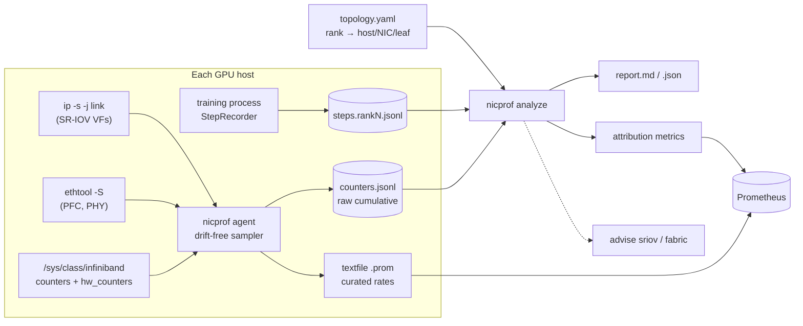

# Architecture

## Problem

A 512-GPU training job slows from 410 ms to 470 ms per step. The network team's
dashboards show millions of counter series across thousands of NIC ports, the ML
team sees only the step time, and nobody can say which counter explains which
millisecond. That is the **attribution gap**. It costs days of cross-team
triage per incident, and it leaves capacity decisions (fabric oversubscription,
RDMA tuning, SR-IOV partition sizes) to intuition.

`nicprof` closes the gap by making the **training step** the unit of analysis
and answering three questions in order:

1. **When** did throughput degrade? (robust baseline, episode detection)
2. **How much** of the excess step time does each NIC signal explain? (additive decomposition)
3. **Where and why?** (cross-rank localisation, root-cause rules, playbook)

## Data flow

## Module map

| Layer | Module | Responsibility |
|---|---|---|
| Model | `model.py`, `topology.py` | `CounterSnapshot`, `RateSample`, rank→NIC bindings. Stdlib only |
| Counters | `counters/catalog.py` | One canonical vocabulary across RDMA sysfs / ethtool / netdev; width and overflow semantics |
| | `counters/rates.py` | Cumulative → per-second rates handling wrap, saturation and reset |
| Collection | `collectors/*` | sysfs RDMA, sysfs netdev, ethtool, SR-IOV; `merge_snapshots` joins RoCE netdev ↔ RDMA device |
| | `agent.py` | Deadline-scheduled loop, ring buffer, JSONL sink, Prometheus textfile, self-metrics |
| Training | `training/recorder.py` | Step boundaries from the training loop (with CUDA sync) |
| | `training/collectives.py` | busbw conventions, alpha-beta ring all-reduce model |
| Analysis | `analysis/align.py` | Overlap-weighted integration of rates over each rank's step windows |
| | `analysis/features.py` | Dimensionless, "higher is worse" features with z-score floors |
| | `analysis/baseline.py` | Median/MAD, episode detection, CUSUM |
| | `analysis/regression.py` | Non-negative ridge (exact Shapley for the additive model) |
| | `analysis/diagnosis.py` | Evidence rules, pause-propagation logic, culprit / victim / scope |
| | `analysis/attribution.py` | Orchestration and report model |
| Decisions | `advisor/playbook.py` | Root cause → concrete knob + how to verify |
| | `advisor/sriov.py` | VF sizing from aggregate burst demand (synchrony index, censoring) |
| | `advisor/fabric.py` | What-if: placement, ECMP entropy, oversubscription, rail-optimised |
| Evaluation | `sim/*`, `evaluate.py` | Fault-injection simulator with ground truth; accuracy and sensitivity sweeps |
| Output | `export/*`, `cli.py` | Markdown, JSON, Prometheus; `nicprof` CLI |

## Key tensors in `analyze()`

| Symbol | Shape | Meaning |
|---|---|---|
| `F` | steps × ranks × features | Feature values integrated over each rank's step window |
| `Z` | steps × ranks × features | `max(0, (F − median_baseline) / max(σ_MAD, floor))`, per rank |
| `X` | steps × model-features | `log1p(Z)` of the **worst rank** per feature, baseline-centred |
| `y` | steps | Step time (slowest rank), baseline-centred |
| `w` | model-features | `argmin ‖Xw − y‖² + λ‖w‖², w ≥ 0` |
| `C = X ⊙ w` | steps × features | Seconds of excess step time per feature per step |

## Deployment shape at scale

* **Edge (per host)**: sampling, rate computation, a local raw-counter ring, and a
  curated Prometheus export (~12 rates per port). Raw history never crosses the
  network unless an episode needs it.
* **Central (per job)**: `analyze` over one job's ranks, triggered by a step-time
  regression alert or run periodically. The cost is O(steps × ranks) window
  integrations. `benchmarks/RESULTS.md` has measured numbers; per-rank feature
  extraction is independent and can move to the edge (the agent sees the step
  boundaries from the local `StepRecorder`), which leaves only the
  steps × features regression centrally.
* **Fleet**: attribution outputs are a few series per job (`nicprof_attributed_seconds{cause,scope}`),
  so fleet-wide questions ("how many GPU-hours did PFC storms cost last month?") are cheap PromQL.
